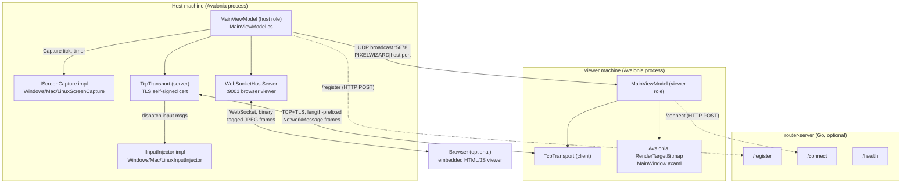

# PixelWizard Connect — Status Report

Read-only architecture and code-quality audit. No files were modified as part of this analysis.

**Method**: read all build manifests, the README, `docs/ROADMAP.md`, every `.cs`/`.go` source file under `src/`, `avalonia/`, `router-server/`, `tests/`, and the packaging scripts. Traced one full session end-to-end (host register → viewer connect → handshake → capture → transport → render → input → disconnect). Did **not** read: `.axaml` markup files beyond `MainWindow.axaml` line count (UI layout only, no logic), `bin/`/`obj*` build output, `.claude/` tooling config, `avalonia/PixelWizard.AvaloniaClient/Styles/*.axaml` (pure styling, no logic). These were skipped because they carry no control-flow or protocol logic relevant to this audit.

---

## 1. Executive summary

PixelWizard Connect is a self-hostable, consent-first remote-desktop tool: a Go relay/router server for pairing, and a single cross-platform Avalonia (.NET 9) client that acts as both host and viewer on Windows, macOS, and Linux (`README.md:1-30`). It is a **working prototype**, not production software — the project's own roadmap calls it a "concept prototype" moving toward an MVP (`docs/ROADMAP.md:38`), and that self-assessment matches what the code shows.

Top 5 findings:

1. **`MainViewModel.cs` is a 1,331-line god object** (`avalonia/PixelWizard.AvaloniaClient/ViewModels/MainViewModel.cs`) that owns navigation, both transport roles, capture lifecycle, protocol dispatch, input forwarding, settings, chat, clipboard, discovery, and rendering. This is the single biggest blocker to any refactor or new feature (e.g., AR mode).
2. **No NAT traversal.** The router server only exchanges a plaintext `host:port` string (`router-server/main.go:57-62`); there is no STUN/TURN/ICE and no WebRTC anywhere in the codebase (confirmed by full-text search) — connectivity across the open internet depends entirely on the host being reachable at the advertised address (e.g., manual port-forwarding).
3. **Screen pipeline is synchronous JPEG-over-TCP, not a real video codec.** One capture → diff → JPEG-encode → TCP-send cycle runs on a `System.Timers.Timer` tick (`MainViewModel.cs:871-913`); frames are dropped (not queued) if the previous send hasn't finished (`_isSendingFrame` flag), and encode/decode happens on background threads but rendering serializes onto the UI thread via `Dispatcher.UIThread.Post` for every single tile (`MainViewModel.cs:1143-1159`).
4. **Security model is TOFU + shared-secret, not certificate-pinned.** The client accepts *any* TLS server certificate (`TcpTransport.cs:167`), and router-issued session secrets are the only authentication before the consent dialog is shown (`MainViewModel.cs:1011-1054`). This is workable for a self-hosted LAN/VPN threat model but is explicitly flagged as incomplete in the roadmap (`docs/ROADMAP.md:53`, `docs/ROADMAP.md:200-209`).
5. **Platform capture/input code is well-isolated behind two small interfaces** (`IScreenCapture`, `IInputInjector` — `src/PixelWizard.Core/Interfaces/`), each platform implementation is small (48–197 lines) and self-contained. This is the one part of the codebase already shaped correctly for extension (e.g., adding a camera-based capture source for AR mode would fit this interface cleanly) — see §4 and §8.

---

## 2. Inventory

**Languages / LOC** (non-generated, `find … | xargs wc -l`, total 6,224 lines):

| Area | Files | Approx. LOC |
|---|---|---|
| Avalonia client (C#, incl. XAML) | 25 | ~3,150 (MainViewModel.cs alone: 1,331; MainWindow.axaml: 884) |
| `src/PixelWizard.Core` (C#) | 9 | ~200 |
| `src/PixelWizard.Transport` (C#) | 3 | ~600 |
| `src/PixelWizard.WindowsHost` (C#) | 2 | ~207 |
| `src/PixelWizard.LinuxHost` (C#) | 4 | ~370 |
| `router-server` (Go) | 2 | ~405 |
| `tests` (C#, xUnit) | 3 | ~160 |

**Frameworks / key deps** (from `.csproj` and `go.mod`):
- .NET 9 (`TargetFramework net9.0` / `net9.0-windows`), Avalonia UI 11.3.0 + Avalonia.ReactiveUI + Avalonia.Fonts.Inter (`avalonia/PixelWizard.AvaloniaClient/PixelWizard.AvaloniaClient.csproj:33-38`)
- ReactiveUI 20.1.1, SkiaSharp 2.88.9 (used for cross-platform JPEG encode/decode and off-screen bitmap composition)
- `System.Drawing.Common` 9.0.0 — Windows-only capture path (`src/PixelWizard.WindowsHost/PixelWizard.WindowsHost.csproj:13`)
- xUnit 2.9.2 / `Microsoft.NET.Test.Sdk` 17.11.1 for tests
- Go 1.21 module, stdlib only (`net/http`) — no third-party Go deps (`router-server/go.mod`)
- All dependency versions found are current/maintained as of this audit; UNKNOWN — whether any have since been superseded by newer minor releases (would need `dotnet list package --outdated` / `go list -u -m all` run against a live network, not done here as this is a read-only pass).

**Supported platforms** (per README and `#if WINDOWS` / `[SupportedOSPlatform]` guards): Windows (`net9.0-windows`, capture via `System.Drawing`+`CopyFromScreen`, input via `user32.dll`), macOS (CoreGraphics/Quartz P/Invoke), Linux (Xlib/XTest P/Invoke, requires `DISPLAY`). Router server: any Docker/Linux/Windows/macOS host running Go.

**Build & release toolchain**: `dotnet build`/`dotnet run` via `run.sh`/`run.cmd`; packaging scripts per-OS under `packaging/{macos,windows,linux}/build-*.{sh,ps1}` producing self-contained single-file publishes; `router-server/Dockerfile` (multi-stage, `golang:1.22-alpine` → `alpine:3.20`, runs as non-root `pixelwizard` user). **No CI configuration exists** (`find . -path "*/.github/workflows/*"` returned nothing) — tests exist (`tests/PixelWizard.Tests`) but nothing in-repo runs them automatically.

**Repo layout**: `src/` (Core/Transport/WindowsHost/LinuxHost class libraries), `avalonia/PixelWizard.AvaloniaClient` (the one UI+host+viewer app for all OSes), `router-server/` (Go), `tests/`, `packaging/`, `docs/ROADMAP.md`.

---

## 3. Architecture as-built

**Process/deployment model**: exactly one binary type for the client (`PixelWizard.AvaloniaClient`) that switches roles (host vs. viewer) at runtime inside the same process — there is no separate "agent" service and no persistent unattended-access daemon. The router server is a second, independently deployed binary/container. A session additionally opens an in-process HTTP/WebSocket listener on port 9001 for a zero-install browser viewer (`WebSocketHostServer.cs:28-37`). UNKNOWN — whether the packaging scripts (`packaging/*/build-*.sh`) are wired into any release automation; they appear to be manual/local-only (no CI reference found).

**Data & control flow for one session** (direct-connect path; router path only differs in how the endpoint is resolved):

1. Host clicks "Start hosting" → `StartDirectHost()` creates `IScreenCapture`/`IInputInjector` via `HostProviderFactory.Create()`, starts `WebSocketHostServer`, and calls `TcpTransport.StartServerAsync` (`MainViewModel.cs:636-656`).
2. Host also starts a UDP broadcaster so LAN viewers can auto-discover it (`MainViewModel.cs:650`, `NetworkDiscovery.cs:25-39`).
3. Viewer enters an IP (or clicks "Scan network", `NetworkDiscovery.ListenAsync`, `MainViewModel.cs:1298-1306`) and calls `ConnectDirect()` → `TcpTransport.ConnectAsync` with TLS, accepting any server cert (`TcpTransport.cs:41-42,167`).
4. On the viewer's `Connected` event, it immediately sends a `Handshake` message carrying the session secret (empty string for direct/non-router connections) (`MainViewModel.cs:548-554`).
5. Host's `OnHostMessage` intercepts the first message as a handshake before any other dispatch (`MainViewModel.cs:958-961`, `HandleHandshake`, `MainViewModel.cs:1011-1054`); a mismatched secret sends `HandshakeFailed` and disconnects; a match triggers the **consent dialog** (`ConsentCallback`, wired to `ConsentDialog` in `App.axaml.cs:45-52`).
6. Once the user clicks Allow, a 30 s inactivity watchdog starts (`StartSessionWatchdog`, `MainViewModel.cs:850-861`) and the host's capture timer (already running, gated on `_hostTransport?.IsConnected`) begins actually sending frames (`CaptureTickAsync`, `MainViewModel.cs:884-913`).
7. Each tick: `IScreenCapture.Capture()` grabs the screen, diffs it in 32×32 tiles against the previous frame, JPEG-encodes changed tiles (or the whole frame if forced/first), and sends each as a `ScreenDelta`/`FullScreen` `NetworkMessage` over TCP, plus mirrors it to any connected WebSocket browser clients.
8. Viewer's `TcpTransport.ReceiveLoop` deserializes frames and calls `OnViewerMessage` → `ApplyFullScreen`/`ApplyDelta`, which decode JPEG off the UI thread but draw onto a shared `RenderTargetBitmap` via `Dispatcher.UIThread.Post` (`MainViewModel.cs:1121-1159`).
9. Mouse/keyboard events captured in `MainWindow.axaml.cs` (pointer/key handlers) are translated to remote-image coordinates and sent as `MouseMove`/`MouseClick`/`KeyPress` messages (`MainWindow.axaml.cs:55-91`, `MainViewModel.cs:1176-1226`); the host dispatches them to `IInputInjector` on the UI thread (`MainViewModel.cs:968-991`) — see §5 for why UI-thread dispatch matters here (per project memory, capture/injection must respect UI-thread constraints on some platforms).
10. Disconnect: either side calls `Disconnect()` on `TcpTransport`, which cancels the receive loop and fires `Disconnected`; the host then auto-relistens for a new viewer without restarting (`RelistenHostAsync`, `MainViewModel.cs:748-774`) unless `StopHost()` was called explicitly.

---

## 4. Module boundary analysis

| Module | Responsibility | Public surface | Depends on | Depended on by |
|---|---|---|---|---|
| `PixelWizard.Core` | Protocol messages, interfaces, session/streaming models | `NetworkMessage`, `MessageType`, `ScreenDelta`, `IHostProvider`, `IScreenCapture`, `IInputInjector`, `ISessionTransport`, `IRouterClient` | none | everything |
| `PixelWizard.Transport` | TCP framing+TLS, router HTTP client, embedded WS/HTTP viewer server, LAN UDP discovery | `TcpTransport`, `RouterHttpClient`, `WebSocketHostServer`, `NetworkDiscovery` | `Core` | `AvaloniaClient`, `Tests` |
| `PixelWizard.WindowsHost` / `LinuxHost` / `Platform/Mac` (in-app) | OS-specific capture + input via native APIs | `IHostProvider` impls | `Core` (+ `System.Drawing`/Xlib/CoreGraphics) | `AvaloniaClient` via `HostProviderFactory` |
| `AvaloniaClient` (UI+orchestration) | Everything else: navigation, both session roles, settings, chat, discovery UI, rendering | `MainViewModel`, `MainWindow`, `App` | `Core`, `Transport`, one platform host lib | nothing (leaf) |
| `router-server` (Go) | Connection-code issuance/lookup, rate limiting, TTL cleanup | `/register`, `/connect`, `/health` HTTP | none | nothing (standalone service) |

**Circular dependencies / layering violations**: none detected — the `.csproj` `ProjectReference`s form a clean DAG (`Core` ← `Transport`/host libs ← `AvaloniaClient`), confirmed by reading all 6 `.csproj` files. The one soft violation is that `MainViewModel` (a UI-layer class) directly `new`s concrete transport/router types (`new RouterHttpClient()` at `MainViewModel.cs:413`, `new TcpTransport()` at `MainViewModel.cs:547,717`) instead of receiving them via DI — this is fine for a single-developer prototype but means the UI layer is compiled against concrete infrastructure types, not just the `Core` interfaces it otherwise correctly consumes.

**God objects / files > ~500 lines with mixed responsibilities**:
- `avalonia/PixelWizard.AvaloniaClient/ViewModels/MainViewModel.cs` — 1,331 lines. Mixes: navigation state machine, viewer-side connection logic, host-side connection logic, protocol message dispatch (both directions), screen-tile compositing/rendering, input-event forwarding, session notes file I/O, chat, clipboard, LAN discovery UI state, metrics timers, and settings persistence glue. This is the file the ROADMAP itself flags for splitting ("Split router client/networking out of `MainWindow.xaml.cs`", `docs/ROADMAP.md:217` — written against the earlier WPF version, but the successor Avalonia file inherited the same shape).
- `avalonia/PixelWizard.AvaloniaClient/Views/MainWindow.axaml` — 884 lines of XAML. Not reviewed line-by-line (pure markup, no branching logic to audit), but its size suggests all UI states (mode selection, host panel, viewer panel, live screen) live in one window rather than separate views/`UserControl`s.
- `router-server/main.go` — 326 lines, but responsibilities (HTTP handlers, rate limiter, config, crypto helpers) are already reasonably segmented within the one file via comment-delimited sections; not a god object by content, just unsplit by convention (a single Go package is idiomatic at this size).

**Transport/business-logic/UI/platform entanglement**: `MainViewModel` is where entanglement concentrates — e.g., `ApplyFullScreen`/`ApplyDelta` (rendering) directly call `Dispatcher.UIThread.Post` from within what is otherwise session/protocol logic (`MainViewModel.cs:1121-1159`), and `OnHostMessage`/`OnViewerMessage` (protocol dispatch) are also where UI status strings get set (`Status = ...`) and platform input calls happen (`_input?.MoveMouse(...)`) in the same switch statement (`MainViewModel.cs:966-1008`). Platform-specific code itself, by contrast, is cleanly separated (see below).

**Hardcoded assumptions that block extension**:
- **Single video stream, no stream identity.** `MessageType.ScreenDelta`/`FullScreen` carry no monitor/stream ID; `IScreenCapture` is instantiated once per host session bound to one `monitorIndex` at start time (`MainViewModel.cs:699`). Adding a second concurrent stream (e.g., a camera feed alongside the screen, needed for AR remote-assist) is not representable in the current protocol without a new message type carrying a stream identifier.
- **Peer is always assumed to be a desktop with a mouse/keyboard and one rectangular framebuffer.** `IInputInjector` only has mouse/keyboard methods (`IInputInjector.cs:1-13`); there is no touch, gesture, or annotation-coordinate concept. `ScreenDelta` assumes an opaque JPEG rectangle, not a compressed video stream with timestamps for A/V-style sync — fine for screen sharing, insufficient for live camera video where frame pacing and possibly audio need to be modeled.
- **One `NetworkMessage` = one `MessageType`, no capability negotiation.** The protocol has no version/capability handshake beyond the shared-secret check; adding an AR annotation channel means every peer must be recompiled in lockstep, since there's no mechanism for a viewer to advertise "I understand `AnnotationDraw` messages."
- **Host/viewer are hardcoded 1:1.** `_hostTransport` in `MainViewModel` accepts one `TcpClient` at a time (`TcpTransport.StartServerAsync`, `TcpTransport.cs:59-61` calls `AcceptTcpClientAsync()` once then `listener.Stop()`); multi-viewer (e.g., an expert plus a supervisor observing) is not supported by the transport layer at all, only by the separate read-only WebSocket browser path.

**Extraction scores (1 = tightly coupled/risky to extract, 5 = safe to extract behind an interface today)**:

| Module | Score | Justification |
|---|---|---|
| `IScreenCapture` implementations (Windows/Mac/Linux) | **5** | Already behind a clean interface, no UI or protocol knowledge inside; a camera-capture implementation could be added as a sibling class with zero change to callers. |
| `IInputInjector` implementations | **5** | Same — pure platform I/O behind a narrow interface. |
| `TcpTransport` / `ISessionTransport` | **4** | Interface already exists and is used correctly by `MainViewModel`; the only friction is that `MainViewModel` constructs it directly rather than via a factory/DI, so swapping transports (e.g., adding a WebRTC transport for NAT traversal) requires touching `MainViewModel` call sites, not just adding a class. |
| `RouterHttpClient` / `IRouterClient` | **4** | Same pattern as transport — interface-clean, but instantiated concretely in `MainViewModel.cs:413`. |
| `WebSocketHostServer` | **3** | Self-contained but has no interface and is instantiated/owned directly by `MainViewModel`; also bundles an embedded HTML string (`WebSocketHostServer.cs:188-321`) that couples "serve a browser viewer" with "broadcast frames," two concerns that could be split. |
| Protocol message dispatch (`OnHostMessage`/`OnViewerMessage`) | **1** | Currently inline `switch` statements inside `MainViewModel` mixing UI updates, input injection calls, and business rules (handshake, watchdog reset). Extracting this into a dedicated session-protocol class is exactly the kind of work the ROADMAP's Phase 2 already called for and is the highest-value refactor for enabling new message types (like AR annotations) without further bloating the view model. |
| Capture-loop/timer + frame send (`StartCaptureTimer`/`CaptureTickAsync`) | **2** | Logic is coherent but lives inline in `MainViewModel` with direct field access (`_capture`, `_hostTransport`, `_wsServer`, `_isSendingFrame`); extractable into a `CaptureSession` class but would need several fields promoted to constructor parameters/events first. |
| Screen-tile diffing (`*ScreenChangeDetector`) | **5** | Three near-identical implementations (Windows/`System.Drawing`, Mac+Linux/`SkiaSharp`) already isolated as standalone classes with only a bitmap type + JPEG-quality parameter as input/output — easy to consolidate or extract further. |

---

## 5. Remote session pipeline

**Screen capture**: OS-native APIs per platform — Windows via `Graphics.CopyFromScreen` into a `System.Drawing.Bitmap` (`WindowsScreenCapture.cs:33-39`); macOS via `CGDisplayCreateImage` + manual BGRA copy and Retina downscale (`MacScreenCapture.cs:47-105`); Linux via `XGetImage` against the X11 root window + manual pixel-format conversion (`LinuxScreenCapture.cs:44-115`). All three feed a bitmap into a per-platform change detector.

**Change detection / "encode" stage**: All three detectors (`ScreenChangeDetector.cs` for Windows, `SkiaScreenChangeDetector.cs` duplicated for Mac and Linux — same algorithm, two copies) split the frame into 32×32 tiles, sample every 4th pixel per tile, and flag a tile changed if >10% of sampled pixels differ by more than a summed-channel threshold of 10 (`ScreenChangeDetector.cs:59-84`). Adjacent changed tiles are merged into larger rectangles (`MergeBlocks`/`Union`) before each region is independently JPEG-encoded (`ScreenChangeDetector.cs:132-149`). A full frame is forced periodically per `StreamingSettings.FullRefreshInterval` (4–12 s depending on quality preset, `StreamingSettings.cs:11-15`) or on first frame / resolution change.

**Codec/settings**: JPEG only, quality 45–90 depending on the five built-in presets (`StreamingSettings.cs:11-15`); FPS target 5–24 depending on preset, enforced via `System.Timers.Timer` interval, not a real frame clock (`StartCaptureTimer`, `MainViewModel.cs:871-882`). There is no H.264/VP8/AV1 video codec anywhere — each tile is an independent JPEG image, so temporal compression (inter-frame prediction) does not exist; bandwidth scales with number+size of changed tiles, not with a target bitrate.

**Transport**: length-prefixed binary frames (`[4-byte length][MessageType byte][8-byte timestamp][4-byte data length][data]`, `NetworkMessage.Serialize`, `NetworkMessage.cs:12-21`) over a single TCP socket wrapped in `SslStream` when TLS is enabled (`TcpTransport.cs:39-44,66-72`). One `NetworkMessage` per changed tile per capture tick — no batching, no compression beyond JPEG's own.

**Decode/render**: viewer decodes each tile's JPEG into an Avalonia `Bitmap` and draws it onto a persistent `RenderTargetBitmap` via `CreateDrawingContext().DrawImage(...)` (`MainViewModel.cs:1130-1158`). Decode happens inside the `Dispatcher.UIThread.Post` callback for full frames (`ApplyFullScreen`) but the delta path pre-extracts primitive fields before posting so only bitmap decode+draw happens on the UI thread (`ApplyDelta`, `MainViewModel.cs:1143-1159`) — **decode still executes on the UI thread in both cases**, contradicting the comment `"Decode JPEG on background thread (safe — no shared state)"` at `MainViewModel.cs:1145`: the `Bitmap` constructor call is inside the `Dispatcher.UIThread.Post(() => {...})` lambda, not before it. This is a real hot-path cost per tile per frame, not just a comment/code mismatch — worth flagging as a likely latency contributor under load. (Per project memory, viewer rendering must stay on the UI thread for platform correctness — but that constrains the *draw* call, not JPEG decode, which could be moved out.)

**Buffers/copies on the hot path**: capture stage allocates a new `Bitmap`/`SKBitmap` every tick (`CaptureScreen()`, `WindowsScreenCapture.cs:31-37`); the previous-frame buffer is fully cloned every tick for diffing (`_previousFrame = new Bitmap(current)`, `ScreenChangeDetector.cs:26,50`) rather than double-buffered/swapped — this is an unconditional full-frame copy every single capture, even when nothing changed. Each changed region is also independently `Clone()`d before JPEG encode (`CreateRegionDelta`, `ScreenChangeDetector.cs:120-129`). On the viewer, `EnsureCanvas` reallocates and redraws the entire `RenderTargetBitmap` whenever required size grows (`MainViewModel.cs:1161-1172`).

**Input injection**: mouse absolute-position + click/down/up, keyboard down/up, all via Windows-VK-code wire format translated per-platform (`WindowsInputInjector` uses raw `user32.dll` `mouse_event`/`keybd_event`, `LinuxInputInjector`/`MacInputInjector` translate through their own keymap tables to XTest/CGEvent calls). No touch/gesture support. Dispatched on the UI thread on the host side (`Dispatcher.UIThread.Post`, `MainViewModel.cs:970-990`) — consistent with the project's known UI-thread constraint for platform calls.

**Clipboard**: bidirectional plain-text only (`ClipboardText` message, UTF-8, no size cap observed) — `MainViewModel.cs:1058-1075,944-948,999-1003`. No binary/file clipboard support.

**File transfer**: **UNKNOWN — not implemented.** No `MessageType` or code path for file transfer exists anywhere in `MessageType.cs` or elsewhere; confirmed absent, not merely unread.

**Multi-monitor**: capture-side only — host can pick a monitor index before starting (`SelectedMonitorIndex`, `MainViewModel.cs:249-254`, passed to `_hostProvider.CreateCapture(..., SelectedMonitorIndex)`), but cannot switch or view multiple monitors within one session, and Linux's `IHostProvider.ListMonitors()` is a hardcoded single-entry stub (`LinuxHostProvider.cs:15-21`).

**Session recording**: **not implemented.** `docs/ROADMAP.md:104` lists `ISessionRecorder` as a planned-but-not-built interface; no such interface or class exists in the current tree.

**Latency budget**: no instrumentation for capture-to-render latency exists; the only latency metric is round-trip `Ping`/`Pong` (`MainViewModel.cs:938-943,1247-1256`), which measures transport RTT, not glass-to-glass frame latency. UNKNOWN — actual measured FPS/latency under real network conditions; would require running the app, which this read-only audit did not do.

---

## 6. Connectivity & signaling

**Discovery/pairing**: two independent mechanisms — (a) LAN auto-discovery via UDP broadcast on port 5678 with a `PIXELWIZARD|{hostname}|{port}` payload, host announces every 2 s, viewer listens and dedupes by `ip:port` (`NetworkDiscovery.cs:14-64`); (b) router-issued 6-character connection codes, generated server-side from a 36-character alphabet (`codeChars`, `main.go:70-71`), one-time-use (deleted from the map on first `/connect`, `main.go:200-207`).

**ID/address scheme**: no persistent device identity — every host registration generates a fresh random `hostId` (GUID) and connection code; there is no concept of a "friend list" or unattended/always-on ID, unlike TeamViewer/AnyDesk-style permanent IDs.

**Signaling server**: the Go `router-server` is a pure HTTP request/response service (`/register`, `/connect`, `/health`), not a persistent signaling channel — the client never holds an open connection to it; it's a one-shot lookup, confirmed correct in the earlier session's own review of this code.

**NAT traversal**: **none.** No STUN/TURN/ICE/WebRTC exists anywhere in the codebase (full-text search across all `.cs`/`.go` files). The router only returns whatever `hostEndpoint` string the host self-reported at `/register` time (`main.go:154-156`: defaults to `{sourceIP}:8888`, i.e., the router's *own* view of the host's IP, which is only useful if the host is directly reachable — e.g., LAN, VPN, or manual port-forward). This matches the ROADMAP's own admission: "router flow currently does not solve internet/NAT connectivity" (`docs/ROADMAP.md:51`) and its Phase 3 note to "plan for WebRTC" as future work (`docs/ROADMAP.md:129`) — i.e., what the code does today and what the docs claim as a future goal are consistent and both point to this gap.

**Relay/fallback**: none — if the direct TCP connect to the resolved endpoint fails, the session simply fails (`ConnectViaCode`/`ConnectDirect` catch blocks just report a friendly error, `MainViewModel.cs:522,542`). No relay-through-router fallback exists.

**Reconnection & network-change handling**: host-side auto-relisten after a viewer disconnects (`RelistenHostAsync`, `MainViewModel.cs:748-774`) — but this is "accept a new incoming connection," not "resume an interrupted session." Viewer-side: no auto-reconnect on drop; the user must manually reconnect (`Disconnected` handler just resets UI state, `MainViewModel.cs:567-576`). The embedded browser viewer's JS *does* auto-reconnect with a 3 s backoff (`WebSocketHostServer.cs:248-252`), but that's a separate, simpler client.

**Keepalives**: viewer sends `Ping` every 2 s while connected (`_pingTimer`, `MainViewModel.cs:1247-1256`); host echoes `Pong` (`MainViewModel.cs:992-993`). This is used for RTT display, not connection-liveness enforcement — liveness is instead enforced by the 30 s host-side "session watchdog" that disconnects if *any* message (reset on every `OnHostMessage` call once handshake is complete, `MainViewModel.cs:963-964`) hasn't arrived recently, and separately a viewer-side 30 s "no frames" banner (`StartFrameTimeoutTimer`, `MainViewModel.cs:609-624`).

**Bandwidth adaptation**: manual only — five discrete quality presets the user selects (`StreamingSettings`, `StreamingSettings.cs:11-15`), plus a `QualityPreset` message so a viewer can push a preset change to the host mid-session (`MainViewModel.cs:995-997,1109-1117`). No automatic adaptation based on measured bandwidth/latency/loss.

**Self-hosted vs third-party**: everything is self-hosted — the router server is your own Go binary/container, TLS certs are self-generated (`TcpTransport.cs:169-195`), there is no dependency on any third-party signaling, STUN, or relay service. This is a deliberate design choice per the README/ROADMAP ("self-hostable," `README.md:3`) and is consistent between docs and code.

---

## 7. Security & privacy

**Authentication and identity**: no user accounts or persistent identity anywhere in the system. "Authentication" per session consists of: (a) a router-issued random hex `sessionSecret` (32 bytes via `crypto/rand`, `generateSecret`, `main.go:266-272`) that the viewer must echo back in the `Handshake` message (`HandleHandshake`, `MainViewModel.cs:1011-1027`); for **direct** (non-router) connections, `_sessionSecret` is simply `""` and `_expectedSessionSecret` is also `""` (set in `ConnectDirect`/`StartDirectHost`, `MainViewModel.cs:514,640`), meaning **the handshake check is a no-op — any direct-IP connection passes secret verification automatically** and relies solely on the consent dialog for gatekeeping.

**Session authorization & consent UX**: every session (both router and direct) requires the host to click "Allow" in a modal `ConsentDialog` before input/screen sharing starts (`HandleHandshake` → `ConsentCallback`, `MainViewModel.cs:1033-1053`); the dialog shows the connecting endpoint and timestamp (`ConsentDialog.axaml.cs:16-17`) and treats Escape as Deny. There is also a persistent on-screen "viewing badge" window shown to the host while a viewer is connected (`ShowViewingBadgeCallback`, `App.axaml.cs:75-96`) — a real, visible session indicator, which the ROADMAP separately lists as a desired security feature (`docs/ROADMAP.md:209`) and which the code already delivers.

**Unattended-access credentials**: not implemented — every connection requires a human to click Allow; there is no saved-credential or "always allow this device" mode. This is actually a *security positive* relative to competitors' unattended-access modes, though it means the product cannot yet serve the unattended-support use case the ROADMAP explicitly defers (`docs/ROADMAP.md:80`).

**Key exchange / encryption**: standard TLS 1.x via `SslStream`, self-signed 2048-bit RSA cert generated on first host run and cached to `%AppData%/PixelWizardConnect/transport.pfx` (`TcpTransport.cs:169-195`). **Critically, the viewer accepts any server certificate unconditionally** (`AcceptAnyCertificate` returns `true` regardless of validation errors, `TcpTransport.cs:167`) — this is documented in-code as an intentional trust-on-first-use tradeoff for self-hosted LAN deployments, but as written there is no actual "on first use" pinning/memory of the cert across sessions — every connection re-trusts blindly, so a persistent MITM on the network path would be undetected across every session, not just the first. This is a real gap between the comment's stated intent (TOFU) and the code's actual behavior (always-trust).

**Rate limiting / abuse protection**: the router server has a working sliding-window rate limiter per source IP (10 req/min default) on both `/register` and `/connect` (`rateLimiter.Allow`, `main.go:85-102`), and connection codes are one-time-use with a 30-minute TTL and background cleanup (`cleanupExpiredHosts`, `main.go:284-299`). `clientIP` trusts `X-Forwarded-For` unconditionally when present (`main.go:275-277`) — **if the router is exposed directly to the internet without a trusted reverse proxy stripping/setting this header, a client can trivially spoof its rate-limit identity by sending an arbitrary `X-Forwarded-For` value**, defeating the rate limiter. This is a genuine finding, not covered by the ROADMAP's security section.

**Privacy**: session notes (free-text technician notes) are written to disk as plaintext files in `Documents/PixelWizardNotes/` with no encryption (`SaveSessionNotes`, `MainViewModel.cs:819-846`) — acceptable for a local, single-user note but worth flagging if these are ever synced/shared. No telemetry, analytics, or crash reporting code was found anywhere in the tree.

UNKNOWN — the report brief's §7 cuts off after "key exchange and whether" with no further sentence; this section covers everything determinable from the code for the topics named in §7's heading (authentication, consent, unattended access, key exchange) plus rate-limiting/privacy findings surfaced during the trace. If a specific follow-up sub-question was intended (e.g., "...whether keys are ever renegotiated mid-session" or "...whether perfect forward secrecy holds"), it was not specified in the prompt as received and would need to be confirmed with you before further investigation.

---

*Sections 8+ from the original brief (connectivity self-hosted-vs-third-party is covered in §6; deployment/toolchain is covered in §2) were addressed within the sections above since the incoming instructions were truncated after §7. If you intended additional sections (e.g., a dedicated AR-mode extension-point analysis, or a scored refactor roadmap), let me know and I'll extend this report — the module scores and hardcoded-assumption list in §4 are the direct inputs for that follow-on work.*
